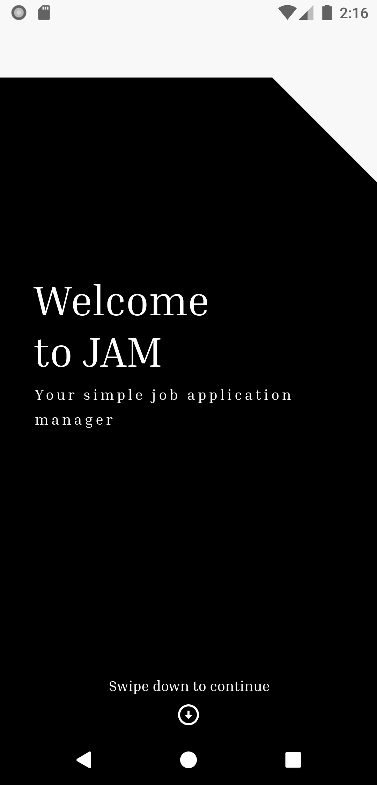
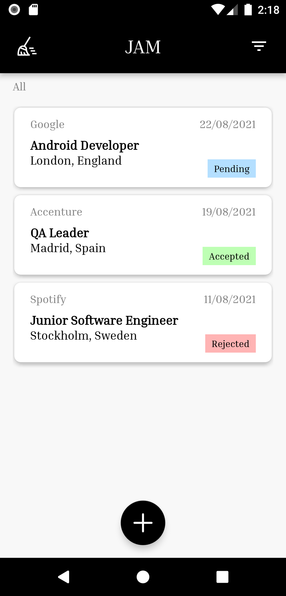
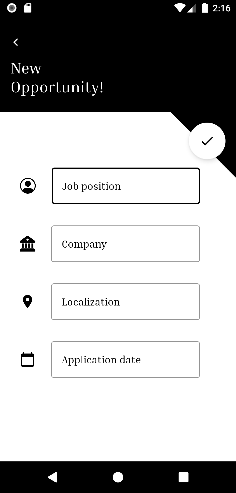
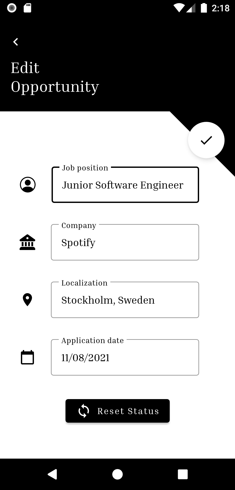

# JAM

JAM is a job application manager where the user can have up to date his/her job applications. Each one is defined by:

- Job Position
- Company
- Location
- Status
- Application Date

## Using JAM

### Main Screen (Second Image)

#### Clear Accepted & Rejected Job Applications

- Click the top-left button with the broom image and a warning dialog will appear.
- Click `Clean`

#### Filter Job Applications

- Click the top-right button with the triangle-lined-inverse-shape image and a menu will pop up.
- Select `All`, `Pending`, `Accepted` or `Rejected` to show job applications matching the chosen status.

#### Mark Job Application as Accepted/Rejected

- Swipe `right` a pending application to mark it as `accepted`
- Swipe `left` a pending application to mark it as `rejected`

#### Edit a Job Application

- Click the job application desired and the editing screen will appear (Fourth Image).
- Change any parameter and/or reset the status by clicking on the `Reset Status` button.
- Click the top-right button with the check image to save the changes.

#### Add a New Job Application

- Click the bottom-center button with the plus image and the adding screen will appear (Third Image).
- Fill in all the parameters (Job Position, Company and Location).
- Click the Application Date input text to pop up the calendar.
- Choose the application date and click `OK`.
- Click the top-right button with the check image to add the new job application.

**Note:** status is always `pending` by default.

## Contribute to JAM

If you want to contribute to JAM, make sure to commit following the conventional-commits rules and following the `Pull Request` & `Issue` templates. 

## Built with

- [Android Studio](https://developer.android.com/studio) - The IDE used.
- [Kotlin](https://kotlinlang.org/) - The coding language used.
- Android Jetpack Components with MVVM.
- The list of external libraries and dependencies can be seen in [build.gradle](app/build.gradle)

## Author

- **Carlos Diestro López**

## License

This project is licensed under the MIT License - see the [LICENSE.md](LICENSE.md) file for details.
